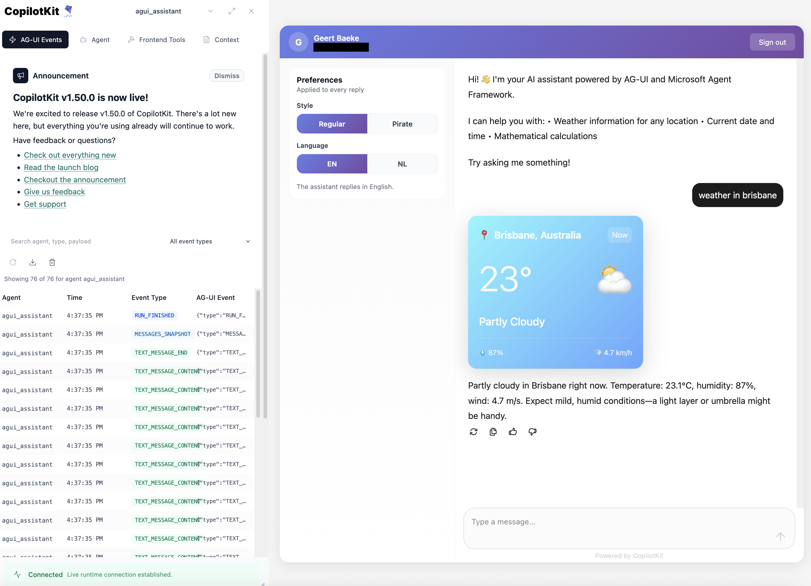

# AG-UI Demo

## Architecture

The application consists of three main components:


1. **Python AG-UI Server** - Backend server providing agentic capabilities
2. **CopilotKit Runtime** - Middleware layer handling agent coordination
3. **React Frontend** - User interface for interacting with the agent

## Setup

### Configure Entra ID Authentication (Optional)

If you want to secure the backend with authentication:

```bash
./setup-entra-auth.sh
```

This creates three Entra ID app registrations (frontend SPA, backend API, Python CLI client). After running:

1. Verify `.env` in `src/` contains the Entra ID variables
2. Grant admin consent:
   ```bash
   az ad app permission admin-consent --id <frontend-client-id>
   az ad app permission admin-consent --id <python-client-id>
   ```

**Note:** Authentication is disabled if Entra ID variables are empty in `.env`.

## Running

Start all three components in separate terminals:

### 1. Python AG-UI Server
```bash
cd src/backend
uv run python server.py
```
Runs on http://127.0.0.1:8888

### 2. CopilotKit Runtime
```bash
cd src/runtime
npm run dev
```
Runs on http://127.0.0.1:3001

### 3. React Frontend
```bash
cd src/frontend
npm run dev
```
Runs on http://127.0.0.1:5173

Open http://127.0.0.1:5173 in your browser.

### Alternative: Run All Services with One Command

Instead of starting each service separately, use the development script:

```bash
cd src
./dev.sh
```

This script:
- Starts all three services (backend, runtime, frontend)
- Shows color-coded logs from each service
- Automatically clears ports if needed
- Stops all services when you press Ctrl+C

### UI


